# Diagrams

UML views of the store, drawn with [Mermaid](https://mermaid.js.org/) so GitHub renders them. The
text in [architecture.md](architecture.md) is authoritative; these diagrams illustrate it.

- [System architecture](#system-architecture)
- [Class diagrams](#class-diagrams): [controller](#controller-request-path),
  [background jobs](#controller-background-jobs-and-events), [data model](#data-model),
  [worker](#worker), [CLI](#cli)
- [Sequence diagrams](#sequence-diagrams): [upload](#upload), [download](#download-with-a-corrupt-copy),
  [worker failure](#worker-failure-and-repair), [rejoin](#worker-rejoin-and-reconciliation),
  [delete](#delete-with-a-worker-down), [scrub](#corruption-found-by-the-scrubber)
- [Activity diagrams](#activity-diagrams): [storing a chunk](#storing-one-chunk-during-an-upload),
  [membership check](#membership-check), [tombstone](#processing-one-tombstone),
  [reconciliation](#reconciling-one-recorded-copy)
- [State machines](#state-machines): [object](#object), [replica](#replica), [worker](#worker-1)

## System architecture

One controller and four workers on a private Compose network. Only the controller's port 8080 is
published; clients never talk to a worker. Each service keeps its state in its own named volume.

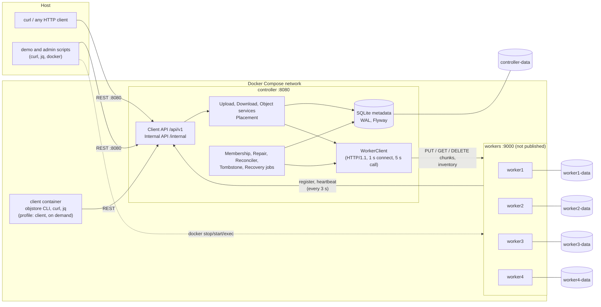
```mermaid
flowchart LR
  subgraph host["Host"]
    curl["curl / any HTTP client"]
    scripts["demo and admin scripts<br/>(curl, jq, docker)"]
  end

  subgraph compose["Docker Compose network"]
    client["client container<br/>objstore CLI, curl, jq<br/>(profile: client, on demand)"]

    subgraph ctl["controller :8080"]
      direction TB
      api["Client API /api/v1<br/>Internal API /internal"]
      services["Upload, Download, Object services<br/>Placement"]
      jobs["Membership, Repair, Reconciler,<br/>Tombstone, Recovery jobs"]
      wc["WorkerClient<br/>(HTTP/1.1, 1 s connect, 5 s call)"]
      db[("SQLite metadata<br/>WAL, Flyway")]
      api --> services
      services --> db
      jobs --> db
      services --> wc
      jobs --> wc
    end

    subgraph workers["workers :9000 (not published)"]
      direction TB
      w1["worker1"]
      w2["worker2"]
      w3["worker3"]
      w4["worker4"]
    end
  end

  v0[("controller-data")]
  v1[("worker1-data")]
  v2[("worker2-data")]
  v3[("worker3-data")]
  v4[("worker4-data")]

  curl -- "REST :8080" --> api
  scripts -- "REST :8080" --> api
  scripts -. "docker stop/start/exec" .-> workers
  client -- "REST" --> api
  wc -- "PUT / GET / DELETE chunks,<br/>inventory" --> workers
  workers -- "register, heartbeat<br/>(every 3 s)" --> api
  db --- v0
  w1 --- v1
  w2 --- v2
  w3 --- v3
  w4 --- v4
```

## Class diagrams

### Controller: request path

The REST layer, the services that implement each flow, and what they depend on. `WorkerClient` is
the only interface: production uses `HttpWorkerClient`, tests use an in-memory fake.

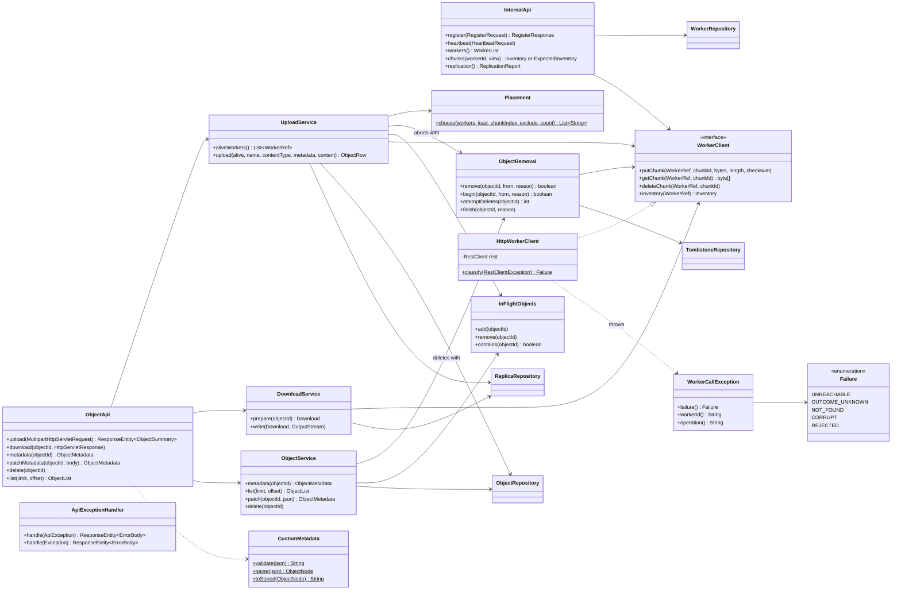
```mermaid
classDiagram
  direction LR
  class ObjectApi {
    +upload(MultipartHttpServletRequest) ResponseEntity~ObjectSummary~
    +download(objectId, HttpServletResponse)
    +metadata(objectId) ObjectMetadata
    +patchMetadata(objectId, body) ObjectMetadata
    +delete(objectId)
    +list(limit, offset) ObjectList
  }
  class InternalApi {
    +register(RegisterRequest) RegisterResponse
    +heartbeat(HeartbeatRequest)
    +workers() WorkerList
    +chunks(workerId, view) Inventory or ExpectedInventory
    +replication() ReplicationReport
  }
  class ApiExceptionHandler {
    +handle(ApiException) ResponseEntity~ErrorBody~
    +handle(Exception) ResponseEntity~ErrorBody~
  }
  class UploadService {
    +aliveWorkers() List~WorkerRef~
    +upload(alive, name, contentType, metadata, content) ObjectRow
  }
  class DownloadService {
    +prepare(objectId) Download
    +write(Download, OutputStream)
  }
  class ObjectService {
    +metadata(objectId) ObjectMetadata
    +list(limit, offset) ObjectList
    +patch(objectId, json) ObjectMetadata
    +delete(objectId)
  }
  class ObjectRemoval {
    +remove(objectId, from, reason) boolean
    +begin(objectId, from, reason) boolean
    +attemptDeletes(objectId) int
    +finish(objectId, reason)
  }
  class InFlightObjects {
    +add(objectId)
    +remove(objectId)
    +contains(objectId) boolean
  }
  class Placement {
    +choose(workers, load, chunkIndex, exclude, count)$ List~String~
  }
  class CustomMetadata {
    +validate(json)$ String
    +parse(json)$ ObjectNode
    +toStored(ObjectNode)$ String
  }
  class WorkerClient {
    <<interface>>
    +putChunk(WorkerRef, chunkId, bytes, length, checksum)
    +getChunk(WorkerRef, chunkId) byte[]
    +deleteChunk(WorkerRef, chunkId)
    +inventory(WorkerRef) Inventory
  }
  class HttpWorkerClient {
    -RestClient rest
    +classify(RestClientException)$ Failure
  }
  class WorkerCallException {
    +failure() Failure
    +workerId() String
    +operation() String
  }
  class Failure {
    <<enumeration>>
    UNREACHABLE
    OUTCOME_UNKNOWN
    NOT_FOUND
    CORRUPT
    REJECTED
  }
  class ObjectRepository
  class ReplicaRepository
  class WorkerRepository
  class TombstoneRepository

  ObjectApi --> UploadService
  ObjectApi --> DownloadService
  ObjectApi --> ObjectService
  ObjectApi ..> CustomMetadata
  UploadService --> Placement
  UploadService --> ObjectRemoval : aborts with
  UploadService --> InFlightObjects
  UploadService --> WorkerClient
  DownloadService --> WorkerClient
  ObjectService --> ObjectRemoval : deletes with
  ObjectService --> InFlightObjects
  ObjectRemoval --> WorkerClient
  HttpWorkerClient ..|> WorkerClient
  HttpWorkerClient ..> WorkerCallException : throws
  WorkerCallException --> Failure
  UploadService --> ObjectRepository
  UploadService --> ReplicaRepository
  DownloadService --> ReplicaRepository
  ObjectService --> ObjectRepository
  ObjectRemoval --> TombstoneRepository
  InternalApi --> WorkerRepository
  InternalApi --> WorkerClient
```

### Controller: background jobs and events

Every job is a class with `runOnce()`, run by a scheduled method on a fixed-size, named scheduler.
Jobs react to Spring events instead of calling each other, so no package depends on a later one.

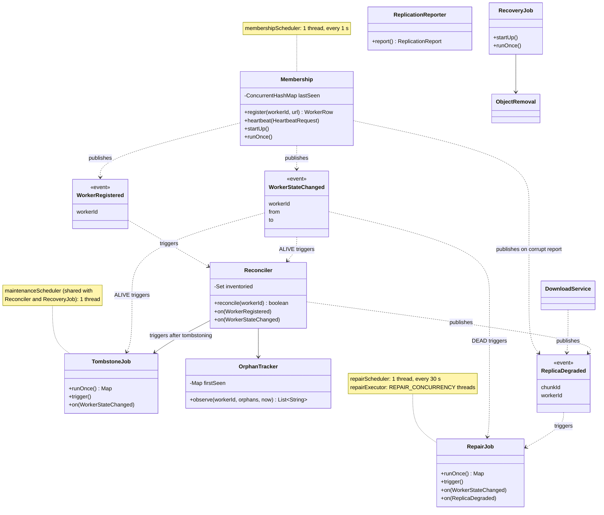
```mermaid
classDiagram
  direction TB
  class Membership {
    -ConcurrentHashMap lastSeen
    +register(workerId, url) WorkerRow
    +heartbeat(HeartbeatRequest)
    +startUp()
    +runOnce()
  }
  class RepairJob {
    +runOnce() Map
    +trigger()
    +on(WorkerStateChanged)
    +on(ReplicaDegraded)
  }
  class Reconciler {
    -Set inventoried
    +reconcile(workerId) boolean
    +on(WorkerRegistered)
    +on(WorkerStateChanged)
  }
  class TombstoneJob {
    +runOnce() Map
    +trigger()
    +on(WorkerStateChanged)
  }
  class RecoveryJob {
    +startUp()
    +runOnce()
  }
  class OrphanTracker {
    -Map firstSeen
    +observe(workerId, orphans, now) List~String~
  }
  class ReplicationReporter {
    +report() ReplicationReport
  }
  class DownloadService
  class ObjectRemoval
  class WorkerStateChanged {
    <<event>>
    workerId
    from
    to
  }
  class WorkerRegistered {
    <<event>>
    workerId
  }
  class ReplicaDegraded {
    <<event>>
    chunkId
    workerId
  }

  Membership ..> WorkerStateChanged : publishes
  Membership ..> WorkerRegistered : publishes
  Membership ..> ReplicaDegraded : publishes on corrupt report
  DownloadService ..> ReplicaDegraded : publishes
  Reconciler ..> ReplicaDegraded : publishes
  WorkerStateChanged ..> RepairJob : DEAD triggers
  ReplicaDegraded ..> RepairJob : triggers
  WorkerRegistered ..> Reconciler : triggers
  WorkerStateChanged ..> Reconciler : ALIVE triggers
  WorkerStateChanged ..> TombstoneJob : ALIVE triggers
  Reconciler --> OrphanTracker
  Reconciler --> TombstoneJob : triggers after tombstoning
  RecoveryJob --> ObjectRemoval

  note for Membership "membershipScheduler: 1 thread, every 1 s"
  note for RepairJob "repairScheduler: 1 thread, every 30 s<br/>repairExecutor: REPAIR_CONCURRENCY threads"
  note for TombstoneJob "maintenanceScheduler (shared with<br/>Reconciler and RecoveryJob): 1 thread"
```

### Data model

The SQLite tables (`V1__init.sql`), as the repositories map them to records. A tombstone has no
foreign key to its chunk, because it outlives the chunk it deletes.

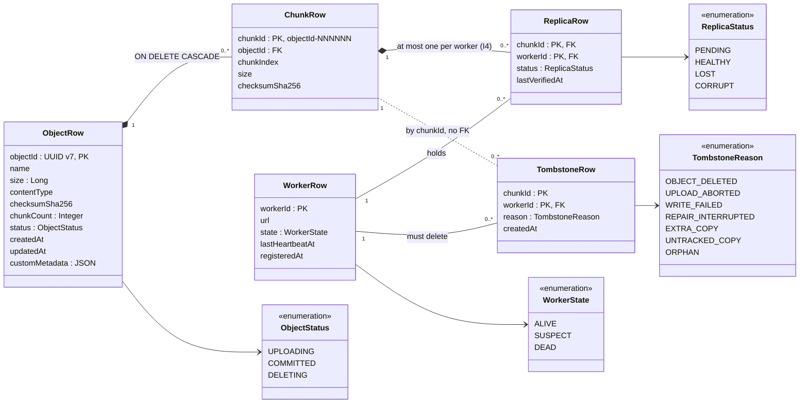
```mermaid
classDiagram
  direction LR
  class ObjectRow {
    objectId : UUID v7, PK
    name
    size : Long
    contentType
    checksumSha256
    chunkCount : Integer
    status : ObjectStatus
    createdAt
    updatedAt
    customMetadata : JSON
  }
  class ChunkRow {
    chunkId : PK, objectId-NNNNNN
    objectId : FK
    chunkIndex
    size
    checksumSha256
  }
  class ReplicaRow {
    chunkId : PK, FK
    workerId : PK, FK
    status : ReplicaStatus
    lastVerifiedAt
  }
  class WorkerRow {
    workerId : PK
    url
    state : WorkerState
    lastHeartbeatAt
    registeredAt
  }
  class TombstoneRow {
    chunkId : PK
    workerId : PK, FK
    reason : TombstoneReason
    createdAt
  }
  class ObjectStatus {
    <<enumeration>>
    UPLOADING
    COMMITTED
    DELETING
  }
  class ReplicaStatus {
    <<enumeration>>
    PENDING
    HEALTHY
    LOST
    CORRUPT
  }
  class WorkerState {
    <<enumeration>>
    ALIVE
    SUSPECT
    DEAD
  }
  class TombstoneReason {
    <<enumeration>>
    OBJECT_DELETED
    UPLOAD_ABORTED
    WRITE_FAILED
    REPAIR_INTERRUPTED
    EXTRA_COPY
    UNTRACKED_COPY
    ORPHAN
  }

  ObjectRow "1" *-- "0..*" ChunkRow : ON DELETE CASCADE
  ChunkRow "1" *-- "0..*" ReplicaRow : at most one per worker (I4)
  WorkerRow "1" -- "0..*" ReplicaRow : holds
  WorkerRow "1" -- "0..*" TombstoneRow : must delete
  ChunkRow "1" .. "0..*" TombstoneRow : by chunkId, no FK
  ObjectRow --> ObjectStatus
  ReplicaRow --> ReplicaStatus
  WorkerRow --> WorkerState
  TombstoneRow --> TombstoneReason
```

### Worker

A worker knows nothing about objects: it stores, verifies and serves chunk files, and keeps the
controller informed.

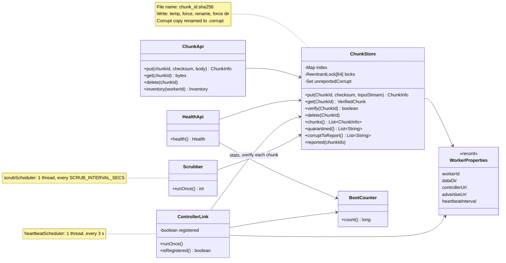
```mermaid
classDiagram
  direction LR
  class ChunkApi {
    +put(chunkId, checksum, body) ChunkInfo
    +get(chunkId) bytes
    +delete(chunkId)
    +inventory(workerId) Inventory
  }
  class HealthApi {
    +health() Health
  }
  class ChunkStore {
    -Map index
    -ReentrantLock[64] locks
    -Set unreportedCorrupt
    +put(ChunkId, checksum, InputStream) ChunkInfo
    +get(ChunkId) VerifiedChunk
    +verify(ChunkId) boolean
    +delete(ChunkId)
    +chunks() List~ChunkInfo~
    +quarantined() List~String~
    +corruptToReport() List~String~
    +reported(chunkIds)
  }
  class BootCounter {
    +count() long
  }
  class ControllerLink {
    -boolean registered
    +runOnce()
    +isRegistered() boolean
  }
  class Scrubber {
    +runOnce() int
  }
  class WorkerProperties {
    <<record>>
    workerId
    dataDir
    controllerUrl
    advertiseUrl
    heartbeatInterval
  }

  ChunkApi --> ChunkStore
  HealthApi --> ChunkStore
  HealthApi --> BootCounter
  ControllerLink --> ChunkStore : stats, corrupt reports
  ControllerLink --> BootCounter
  Scrubber --> ChunkStore : verify each chunk
  ChunkStore --> WorkerProperties
  ControllerLink --> WorkerProperties

  note for ChunkStore "File name: chunk_id.sha256<br/>Write: temp, force, rename, force dir<br/>Corrupt copy renamed to .corrupt"
  note for ControllerLink "heartbeatScheduler: 1 thread, every 3 s"
  note for Scrubber "scrubScheduler: 1 thread, every SCRUB_INTERVAL_SECS"
```

### CLI

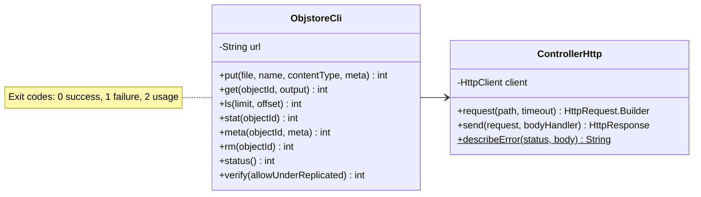
```mermaid
classDiagram
  direction LR
  class ObjstoreCli {
    -String url
    +put(file, name, contentType, meta) int
    +get(objectId, output) int
    +ls(limit, offset) int
    +stat(objectId) int
    +meta(objectId, meta) int
    +rm(objectId) int
    +status() int
    +verify(allowUnderReplicated) int
  }
  class ControllerHttp {
    -HttpClient client
    +request(path, timeout) HttpRequest.Builder
    +send(request, bodyHandler) HttpResponse
    +describeError(status, body)$ String
  }
  ObjstoreCli --> ControllerHttp
  note for ObjstoreCli "Exit codes: 0 success, 1 failure, 2 usage"
```

## Sequence diagrams

### Upload

Steps U1 to U7 of [architecture.md](architecture.md) §9. Every copy has a committed PENDING row
before it is written, and becomes HEALTHY only once its worker confirms a verified write.

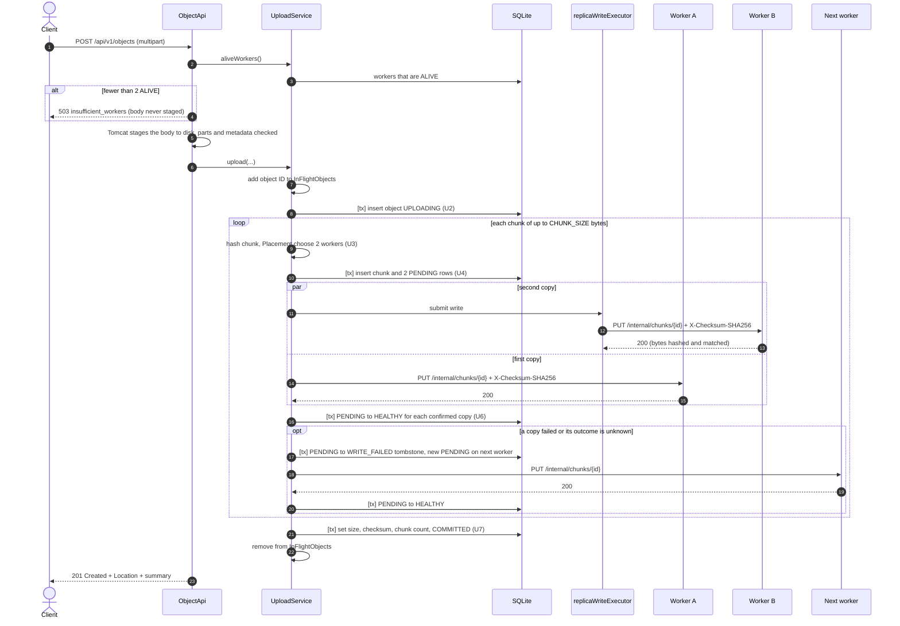
```mermaid
sequenceDiagram
  autonumber
  actor C as Client
  participant API as ObjectApi
  participant U as UploadService
  participant DB as SQLite
  participant EX as replicaWriteExecutor
  participant WA as Worker A
  participant WB as Worker B
  participant WN as Next worker

  C->>API: POST /api/v1/objects (multipart)
  API->>U: aliveWorkers()
  U->>DB: workers that are ALIVE
  alt fewer than 2 ALIVE
    API-->>C: 503 insufficient_workers (body never staged)
  end
  API->>API: Tomcat stages the body to disk, parts and metadata checked
  API->>U: upload(...)
  U->>U: add object ID to InFlightObjects
  U->>DB: [tx] insert object UPLOADING (U2)
  loop each chunk of up to CHUNK_SIZE bytes
    U->>U: hash chunk, Placement.choose 2 workers (U3)
    U->>DB: [tx] insert chunk and 2 PENDING rows (U4)
    par second copy
      U->>EX: submit write
      EX->>WB: PUT /internal/chunks/{id} + X-Checksum-SHA256
      WB-->>EX: 200 (bytes hashed and matched)
    and first copy
      U->>WA: PUT /internal/chunks/{id} + X-Checksum-SHA256
      WA-->>U: 200
    end
    U->>DB: [tx] PENDING to HEALTHY for each confirmed copy (U6)
    opt a copy failed or its outcome is unknown
      U->>DB: [tx] PENDING to WRITE_FAILED tombstone, new PENDING on next worker
      U->>WN: PUT /internal/chunks/{id}
      WN-->>U: 200
      U->>DB: [tx] PENDING to HEALTHY
    end
  end
  U->>DB: [tx] set size, checksum, chunk count, COMMITTED (U7)
  U->>U: remove from InFlightObjects
  API-->>C: 201 Created + Location + summary
```

### Download with a corrupt copy

The controller re-checks every chunk against the metadata before writing it, so a corrupt copy is
never served; the next copy is used and the bad one is marked for repair.

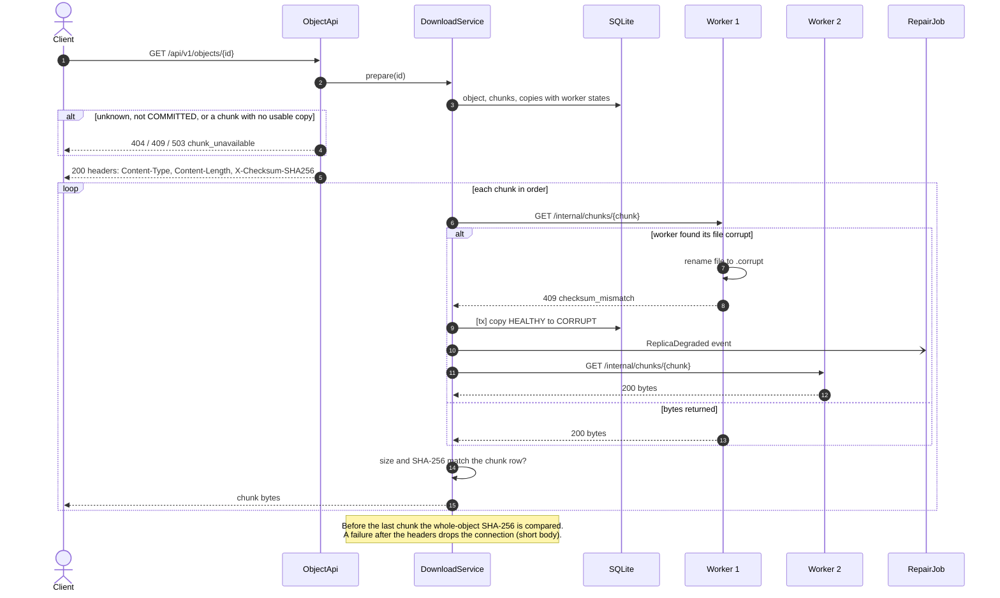
```mermaid
sequenceDiagram
  autonumber
  actor C as Client
  participant API as ObjectApi
  participant D as DownloadService
  participant DB as SQLite
  participant W1 as Worker 1
  participant W2 as Worker 2
  participant R as RepairJob

  C->>API: GET /api/v1/objects/{id}
  API->>D: prepare(id)
  D->>DB: object, chunks, copies with worker states
  alt unknown, not COMMITTED, or a chunk with no usable copy
    API-->>C: 404 / 409 / 503 chunk_unavailable
  end
  API-->>C: 200 headers: Content-Type, Content-Length, X-Checksum-SHA256
  loop each chunk in order
    D->>W1: GET /internal/chunks/{chunk}
    alt worker found its file corrupt
      W1->>W1: rename file to .corrupt
      W1-->>D: 409 checksum_mismatch
      D->>DB: [tx] copy HEALTHY to CORRUPT
      D-)R: ReplicaDegraded event
      D->>W2: GET /internal/chunks/{chunk}
      W2-->>D: 200 bytes
    else bytes returned
      W1-->>D: 200 bytes
    end
    D->>D: size and SHA-256 match the chunk row?
    D-->>C: chunk bytes
  end
  Note over D: Before the last chunk the whole-object SHA-256 is compared.<br/>A failure after the headers drops the connection (short body).
```

### Worker failure and repair

Heartbeat ages come from the controller's own clock. Copies on a SUSPECT worker already stop
counting, so repair starts before the worker is declared DEAD.

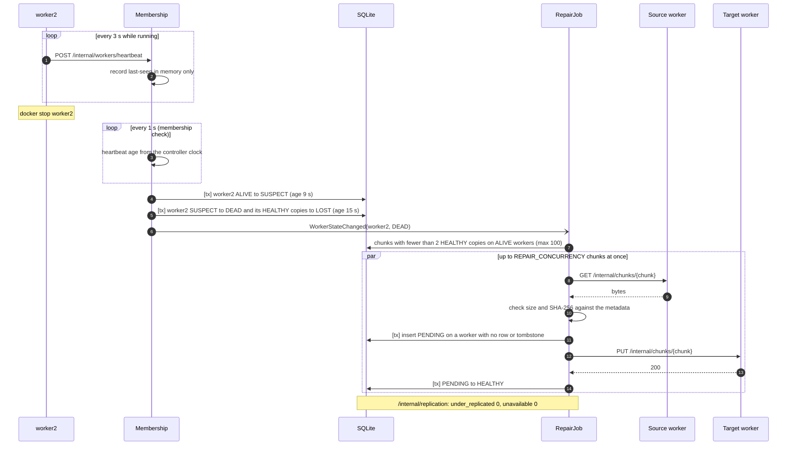
```mermaid
sequenceDiagram
  autonumber
  participant W2 as worker2
  participant M as Membership
  participant DB as SQLite
  participant R as RepairJob
  participant S as Source worker
  participant T as Target worker

  loop every 3 s while running
    W2->>M: POST /internal/workers/heartbeat
    M->>M: record last-seen in memory only
  end
  Note over W2: docker stop worker2
  loop every 1 s (membership check)
    M->>M: heartbeat age from the controller clock
  end
  M->>DB: [tx] worker2 ALIVE to SUSPECT (age 9 s)
  M->>DB: [tx] worker2 SUSPECT to DEAD and its HEALTHY copies to LOST (age 15 s)
  M-)R: WorkerStateChanged(worker2, DEAD)
  R->>DB: chunks with fewer than 2 HEALTHY copies on ALIVE workers (max 100)
  par up to REPAIR_CONCURRENCY chunks at once
    R->>S: GET /internal/chunks/{chunk}
    S-->>R: bytes
    R->>R: check size and SHA-256 against the metadata
    R->>DB: [tx] insert PENDING on a worker with no row or tombstone
    R->>T: PUT /internal/chunks/{chunk}
    T-->>R: 200
    R->>DB: [tx] PENDING to HEALTHY
  end
  Note over R,DB: /internal/replication: under_replicated 0, unavailable 0
```

### Worker rejoin and reconciliation

The returning worker's old copies are compared with the metadata. Extra copies become tombstones,
and a copy is deleted only if 2 HEALTHY copies remain elsewhere (rule N5).

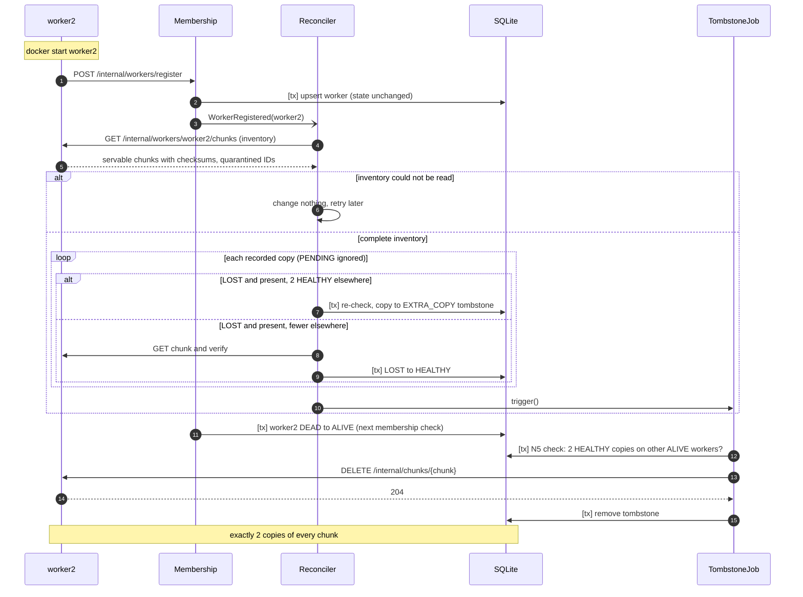
```mermaid
sequenceDiagram
  autonumber
  participant W2 as worker2
  participant M as Membership
  participant RC as Reconciler
  participant DB as SQLite
  participant TJ as TombstoneJob

  Note over W2: docker start worker2
  W2->>M: POST /internal/workers/register
  M->>DB: [tx] upsert worker (state unchanged)
  M-)RC: WorkerRegistered(worker2)
  RC->>W2: GET /internal/workers/worker2/chunks (inventory)
  W2-->>RC: servable chunks with checksums, quarantined IDs
  alt inventory could not be read
    RC->>RC: change nothing, retry later
  else complete inventory
    loop each recorded copy (PENDING ignored)
      alt LOST and present, 2 HEALTHY elsewhere
        RC->>DB: [tx] re-check, copy to EXTRA_COPY tombstone
      else LOST and present, fewer elsewhere
        RC->>W2: GET chunk and verify
        RC->>DB: [tx] LOST to HEALTHY
      end
    end
    RC->>TJ: trigger()
  end
  M->>DB: [tx] worker2 DEAD to ALIVE (next membership check)
  TJ->>DB: [tx] N5 check: 2 HEALTHY copies on other ALIVE workers?
  TJ->>W2: DELETE /internal/chunks/{chunk}
  W2-->>TJ: 204
  TJ->>DB: [tx] remove tombstone
  Note over W2,DB: exactly 2 copies of every chunk
```

### Delete with a worker down

The intent is recorded first, so the client gets `204` even when a worker cannot be reached; that
worker's copies are deleted when it returns.

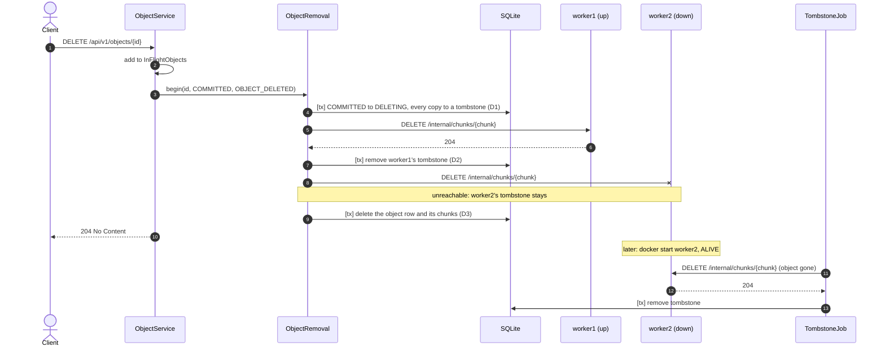
```mermaid
sequenceDiagram
  autonumber
  actor C as Client
  participant S as ObjectService
  participant RM as ObjectRemoval
  participant DB as SQLite
  participant W1 as worker1 (up)
  participant W2 as worker2 (down)
  participant TJ as TombstoneJob

  C->>S: DELETE /api/v1/objects/{id}
  S->>S: add to InFlightObjects
  S->>RM: begin(id, COMMITTED, OBJECT_DELETED)
  RM->>DB: [tx] COMMITTED to DELETING, every copy to a tombstone (D1)
  RM->>W1: DELETE /internal/chunks/{chunk}
  W1-->>RM: 204
  RM->>DB: [tx] remove worker1's tombstone (D2)
  RM-xW2: DELETE /internal/chunks/{chunk}
  Note over RM,W2: unreachable: worker2's tombstone stays
  RM->>DB: [tx] delete the object row and its chunks (D3)
  S-->>C: 204 No Content
  Note over W2: later: docker start worker2, ALIVE
  TJ->>W2: DELETE /internal/chunks/{chunk} (object gone)
  W2-->>TJ: 204
  TJ->>DB: [tx] remove tombstone
```

### Corruption found by the scrubber

No download is needed: the scrubber finds the bad copy, the heartbeat reports it, and repair
rewrites it in place.

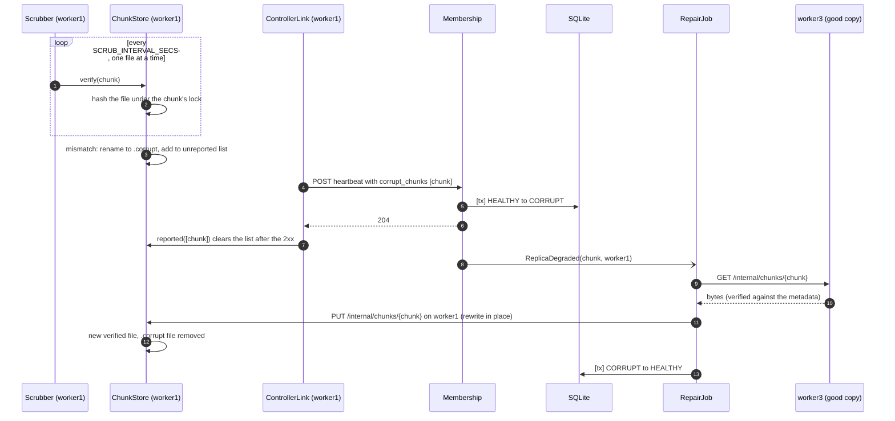
```mermaid
sequenceDiagram
  autonumber
  participant SC as Scrubber (worker1)
  participant CS as ChunkStore (worker1)
  participant L as ControllerLink (worker1)
  participant M as Membership
  participant DB as SQLite
  participant R as RepairJob
  participant W3 as worker3 (good copy)

  loop every SCRUB_INTERVAL_SECS, one file at a time
    SC->>CS: verify(chunk)
    CS->>CS: hash the file under the chunk's lock
  end
  CS->>CS: mismatch: rename to .corrupt, add to unreported list
  L->>M: POST heartbeat with corrupt_chunks [chunk]
  M->>DB: [tx] HEALTHY to CORRUPT
  M-->>L: 204
  L->>CS: reported([chunk]) clears the list after the 2xx
  M-)R: ReplicaDegraded(chunk, worker1)
  R->>W3: GET /internal/chunks/{chunk}
  W3-->>R: bytes (verified against the metadata)
  R->>CS: PUT /internal/chunks/{chunk} on worker1 (rewrite in place)
  CS->>CS: new verified file, .corrupt file removed
  R->>DB: [tx] CORRUPT to HEALTHY
```

## Activity diagrams

### Storing one chunk during an upload

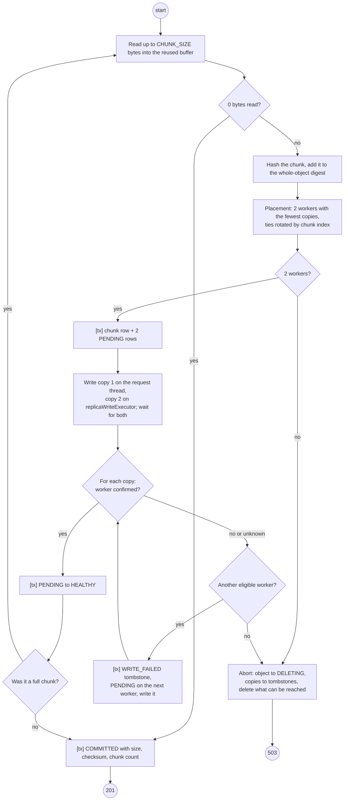
```mermaid
flowchart TD
  start(("start")) --> read["Read up to CHUNK_SIZE bytes into the reused buffer"]
  read --> empty{"0 bytes read?"}
  empty -- yes --> commit["[tx] COMMITTED with size, checksum, chunk count"] --> done(("201"))
  empty -- no --> hash["Hash the chunk, add it to the whole-object digest"]
  hash --> place["Placement: 2 workers with the fewest copies,<br/>ties rotated by chunk index"]
  place --> enough{"2 workers?"}
  enough -- no --> abort["Abort: object to DELETING,<br/>copies to tombstones, delete what can be reached"] --> fail(("503"))
  enough -- yes --> intent["[tx] chunk row + 2 PENDING rows"]
  intent --> write["Write copy 1 on the request thread,<br/>copy 2 on replicaWriteExecutor; wait for both"]
  write --> each{"For each copy:<br/>worker confirmed?"}
  each -- yes --> healthy["[tx] PENDING to HEALTHY"]
  each -- "no or unknown" --> next{"Another eligible worker?"}
  next -- no --> abort
  next -- yes --> replace["[tx] WRITE_FAILED tombstone,<br/>PENDING on the next worker, write it"]
  replace --> each
  healthy --> last{"Was it a full chunk?"}
  last -- yes --> read
  last -- no --> commit
```

### Membership check

Runs once a second on its own thread, the only code that changes a worker's state.

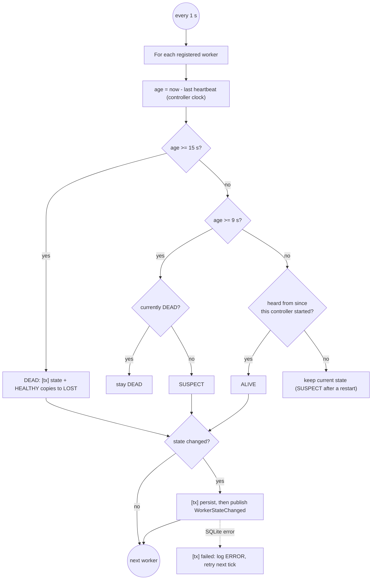
```mermaid
flowchart TD
  tick(("every 1 s")) --> loop["For each registered worker"]
  loop --> age["age = now - last heartbeat (controller clock)"]
  age --> dead{"age >= 15 s?"}
  dead -- yes --> toDead["DEAD: [tx] state + HEALTHY copies to LOST"]
  dead -- no --> suspect{"age >= 9 s?"}
  suspect -- yes --> wasDead{"currently DEAD?"}
  wasDead -- yes --> stay["stay DEAD"]
  wasDead -- no --> toSuspect["SUSPECT"]
  suspect -- no --> heard{"heard from since<br/>this controller started?"}
  heard -- yes --> toAlive["ALIVE"]
  heard -- no --> stay2["keep current state (SUSPECT after a restart)"]
  toDead --> changed
  toSuspect --> changed
  toAlive --> changed
  changed{"state changed?"} -- yes --> persist["[tx] persist, then publish WorkerStateChanged"]
  changed -- no --> nextW(("next worker"))
  persist --> nextW
  persistFail["[tx] failed: log ERROR, retry next tick"]
  persist -. "SQLite error" .-> persistFail
```

### Processing one tombstone

The rule table of [architecture.md](architecture.md) §8. Only tombstones on ALIVE workers are
processed.

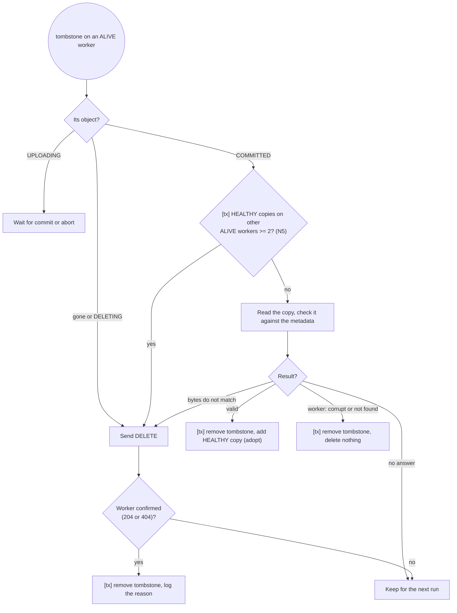
```mermaid
flowchart TD
  t(("tombstone on an ALIVE worker")) --> obj{"Its object?"}
  obj -- "gone or DELETING" --> del["Send DELETE"]
  obj -- UPLOADING --> wait["Wait for commit or abort"]
  obj -- COMMITTED --> n5{"[tx] HEALTHY copies on other<br/>ALIVE workers >= 2? (N5)"}
  n5 -- yes --> del
  n5 -- no --> read["Read the copy, check it against the metadata"]
  read --> valid{"Result?"}
  valid -- valid --> adopt["[tx] remove tombstone, add HEALTHY copy (adopt)"]
  valid -- "worker: corrupt or not found" --> drop["[tx] remove tombstone, delete nothing"]
  valid -- "bytes do not match" --> del
  valid -- "no answer" --> keep["Keep for the next run"]
  del --> ok{"Worker confirmed<br/>(204 or 404)?"}
  ok -- yes --> remove["[tx] remove tombstone, log the reason"]
  ok -- no --> keep
```

### Reconciling one recorded copy

One row of the comparison table of [architecture.md](architecture.md) §9, for a worker whose
complete inventory was read. Steps marked "gated" wait for the startup gate.

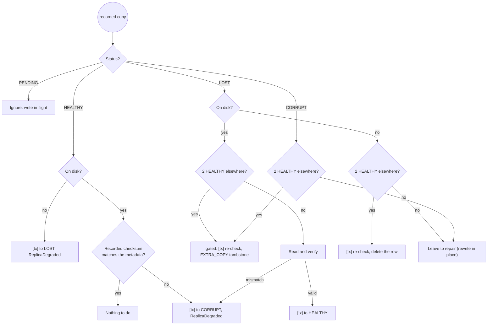
```mermaid
flowchart TD
  r(("recorded copy")) --> st{"Status?"}
  st -- PENDING --> skip["Ignore: write in flight"]
  st -- HEALTHY --> hd{"On disk?"}
  hd -- no --> lost["[tx] to LOST, ReplicaDegraded"]
  hd -- yes --> hc{"Recorded checksum<br/>matches the metadata?"}
  hc -- yes --> fine["Nothing to do"]
  hc -- no --> corrupt["[tx] to CORRUPT, ReplicaDegraded"]
  st -- LOST --> ld{"On disk?"}
  ld -- yes --> le{"2 HEALTHY elsewhere?"}
  le -- yes --> extra["gated: [tx] re-check, EXTRA_COPY tombstone"]
  le -- no --> verify["Read and verify"]
  verify -- valid --> readmit["[tx] to HEALTHY"]
  verify -- mismatch --> corrupt
  ld -- no --> le2{"2 HEALTHY elsewhere?"}
  le2 -- yes --> droprow["[tx] re-check, delete the row"]
  le2 -- no --> repair["Leave to repair (rewrite in place)"]
  st -- CORRUPT --> ce{"2 HEALTHY elsewhere?"}
  ce -- yes --> extra
  ce -- no --> repair
```

## State machines

### Object

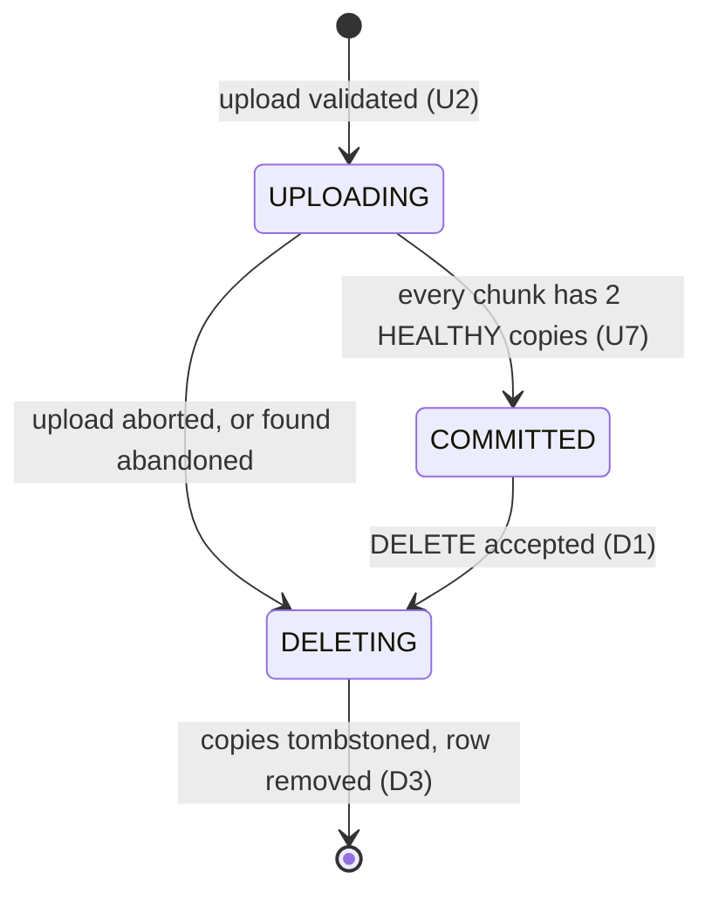
```mermaid
stateDiagram-v2
  [*] --> UPLOADING : upload validated (U2)
  UPLOADING --> COMMITTED : every chunk has 2 HEALTHY copies (U7)
  UPLOADING --> DELETING : upload aborted, or found abandoned
  COMMITTED --> DELETING : DELETE accepted (D1)
  DELETING --> [*] : copies tombstoned, row removed (D3)
```

### Replica

"Tombstone" means the row is replaced by a tombstone in one transaction; the copy is then deleted
or adopted by the tombstone job.

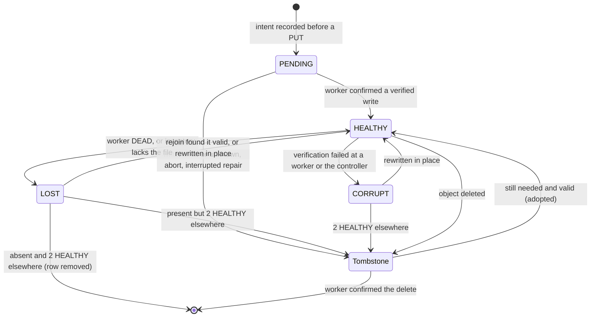
```mermaid
stateDiagram-v2
  [*] --> PENDING : intent recorded before a PUT
  PENDING --> HEALTHY : worker confirmed a verified write
  PENDING --> Tombstone : write failed or unknown, abort, interrupted repair
  HEALTHY --> LOST : worker DEAD, or inventory lacks the file
  HEALTHY --> CORRUPT : verification failed at a worker or the controller
  LOST --> HEALTHY : rejoin found it valid, or rewritten in place
  LOST --> Tombstone : present but 2 HEALTHY elsewhere
  LOST --> [*] : absent and 2 HEALTHY elsewhere (row removed)
  CORRUPT --> HEALTHY : rewritten in place
  CORRUPT --> Tombstone : 2 HEALTHY elsewhere
  HEALTHY --> Tombstone : object deleted
  Tombstone --> [*] : worker confirmed the delete
  Tombstone --> HEALTHY : still needed and valid (adopted)
```

### Worker

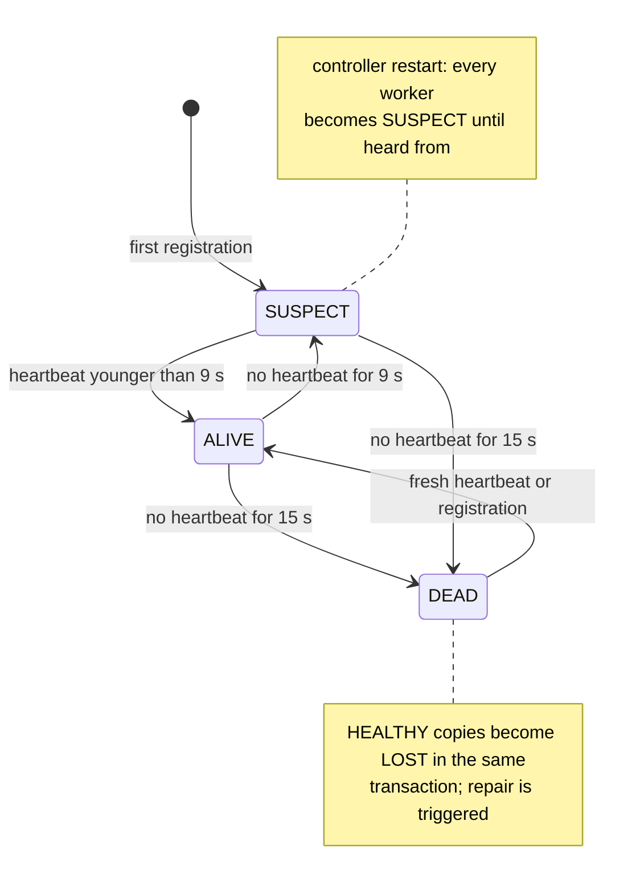
```mermaid
stateDiagram-v2
  [*] --> SUSPECT : first registration
  SUSPECT --> ALIVE : heartbeat younger than 9 s
  ALIVE --> SUSPECT : no heartbeat for 9 s
  ALIVE --> DEAD : no heartbeat for 15 s
  SUSPECT --> DEAD : no heartbeat for 15 s
  DEAD --> ALIVE : fresh heartbeat or registration
  note right of DEAD
    HEALTHY copies become LOST in the same
    transaction; repair is triggered
  end note
  note left of SUSPECT
    controller restart: every worker
    becomes SUSPECT until heard from
  end note
```
